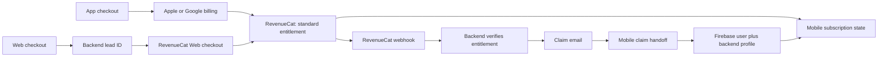

# Nutree Checkout and Subscription Flow

## Purpose

This brief explains the Nutree subscription journey for Product, Business
Analysis, Operations, and Support. It covers app checkout, web checkout, the
web-to-mobile claim handoff, and the authority for each decision.

## Executive Summary

Nutree has two checkout entry points but one entitlement model.

- **App checkout:** a signed-in user buys through Apple or Google billing,
  managed by RevenueCat.
- **Web checkout:** a prospective user buys through RevenueCat Web before they
  have a Nutree account. The purchase is associated with a backend lead, then
  securely claimed in the mobile app.

RevenueCat is the subscription-entitlement authority. MealTrack backend is the
authority for web lead state, payment verification, claims, and profile
restoration. Web and mobile clients display state; neither can grant access.

## At-a-Glance Flow

## App Checkout vs Web Checkout

| Topic | App checkout | Web checkout |
| --- | --- | --- |
| Starting point | User is already in Nutree | User starts in the web funnel |
| Buyer identity at purchase | Firebase user ID | Backend lead ID |
| Payment experience | Native Apple/Google checkout | RevenueCat Web checkout |
| RevenueCat identity | Usually Firebase user ID | Lead ID |
| Access in app | RevenueCat CustomerInfo/listener | Claim maps Firebase user to the paid lead ID, then reads RevenueCat |
| Browser callback grants access? | Not applicable | Never |

## Web Checkout Journey

1. User completes the quiz and submits email.
2. Backend creates a possession-bound lead; the browser receives only a safe
   projection.
3. RevenueCat Web checkout uses the lead ID as its App User ID.
4. User completes checkout.
5. RevenueCat sends a server-to-server event to MealTrack.
6. Backend checks the configured environment and confirms active `standard`
   entitlement.
7. Backend marks the lead verified and queues a one-time claim email.
8. The web success page waits for backend status; it never unlocks access itself.

## Web-to-Mobile Claim Journey

1. User opens the claim link on a phone with Nutree installed.
2. Mobile validates the exact link and keeps credentials in memory only.
3. Mobile exchanges the secret for a short-lived Firebase custom token.
4. Mobile signs in to Firebase, then completes the authenticated backend claim.
5. Backend creates/restores user profile, plan, onboarding, weekly budget, and
   records the paid lead ID as the user's RevenueCat customer ID.
6. Mobile maps Firebase user ID to the paid lead ID, identifies RevenueCat as
   that lead, and refreshes CustomerInfo without native receipt restore.

## Source of Truth

| Decision or data | Source of truth |
| --- | --- |
| Payment transaction | Underlying store/payment provider, represented by RevenueCat |
| Active premium entitlement | RevenueCat active `standard` entitlement |
| Whether a lead receives a claim email | Backend verification of RevenueCat webhook/customer state |
| Lead status, claim expiry/replay, refund/conflict | MealTrack backend |
| Profile, plan, DOB-derived data, weekly budget | MealTrack backend |
| Screen-level subscription state | Mobile RevenueCat-derived state |
| Browser status display | Backend safe lead projection |

## Operating Rules

- RevenueCat offerings, packages, prices, and A/B experiments belong in
  RevenueCat plus the web/mobile clients—not in backend product allowlists.
- Backend verifies only the configured RevenueCat environment and active
  `standard` entitlement.
- A checkout callback is not payment fulfillment.
- Raw email, checkout payload, or claim tokens must never be stored in browser
  storage, analytics, logs, or screenshots.
- The web funnel is always enabled after backend deployment; it has no runtime
  feature flags.

## Lead Lifecycle

| Status | Meaning | Expected next action |
| --- | --- | --- |
| `payment_pending` | Payment is not backend-verified | Wait for RevenueCat event |
| `payment_verified` | Backend confirmed entitlement | Queue/send claim email |
| `email_queued` | Claim email work is queued/sent | User opens link in mobile app |
| `claim_reserved` | Claim handoff is in progress | Allow proof-bound retry only |
| `claimed` | Account restoration completed | User uses the app under paid identity |
| `refunded` | Entitlement revoked/refunded | Block unclaimed handoff |
| `conflict` | Existing identity conflicts | Support investigation; no automatic merge |

## Release Prerequisite

Backend and web are on `delivery`. Before releasing web checkout, mobile
`delivery` must include the claim coordinator and subscription-recovery work from
PRs #587 and #588, followed by a real staging claim journey.

## References

- `docs/web-checkout-production-setup.md`
- `docs/firebase-email-link-identity-handoff.md`
- `docs/email-first-funnel-backend-handoff.md`
