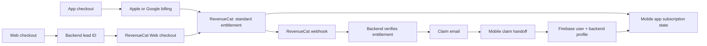

# Nutree Checkout and Subscription Flow

## Purpose

This document explains how Nutree sells subscriptions in the mobile app and on the web, how a web buyer becomes a mobile user, and which system is trusted for each decision.

It is written for Product, Business Analysis, Operations, and Support. It intentionally avoids implementation credentials and provider dashboard IDs.

## Executive Summary

Nutree has two checkout entry points but one subscription entitlement model:

- **App checkout:** a signed-in user buys through Apple or Google billing, managed by RevenueCat.
- **Web checkout:** a prospective user buys through RevenueCat Web before they have a Nutree account. The purchase is first associated with a backend lead, then securely claimed in the mobile app.

RevenueCat is the subscription-entitlement authority. MealTrack backend is the authority for the web lead, payment verification, claim lifecycle, account restoration, and user profile. The web browser and mobile app display state; neither can self-grant access.

## At-a-Glance Flow

## The Two Checkout Journeys

| Topic | App checkout | Web checkout |
| --- | --- | --- |
| Starting point | User is already in the Nutree app | User starts in the web quiz/funnel |
| Buyer identity at purchase | Firebase user ID | Backend lead ID |
| Payment experience | Native Apple or Google checkout | RevenueCat Web checkout |
| RevenueCat identity | Usually Firebase user ID | Lead ID |
| How access appears in the app | RevenueCat returns the active entitlement | Claim flow maps Firebase user ID to the paid lead ID, then reads RevenueCat entitlement |
| Browser callback grants access? | Not applicable | No. It is never enough by itself. |

## Web Checkout: User Journey

1. The user completes the web quiz and enters their email.
2. The web funnel asks the backend to create a **lead**. The browser receives only a safe, limited view of that lead.
3. Web checkout is initialized in RevenueCat using the lead ID as the RevenueCat App User ID.
4. The user completes checkout.
5. RevenueCat sends a server-to-server event to the backend.
6. The backend verifies the event belongs to the configured environment and confirms that the RevenueCat customer has active `standard` entitlement.
7. The backend marks the lead as payment-verified and queues a one-time claim email.
8. The web success page polls lead status and tells the user to continue on their phone. It does not unlock premium access itself.

## Web-to-Mobile Claim Journey

1. The user opens the email link on a phone with Nutree installed.
2. The mobile app validates the exact claim-link format and keeps its credentials only in memory.
3. Mobile asks the backend to exchange the claim secret for a short-lived Firebase custom token.
4. Mobile signs in to Firebase with that custom token.
5. Mobile calls the backend claim-completion endpoint using the newly authenticated Firebase session.
6. The backend atomically:
   - creates or restores the Nutree user;
   - restores profile, onboarding, plan, and weekly budget data;
   - records the paid lead ID as the user's RevenueCat customer ID;
   - consumes the one-time claim.
7. Mobile stores the mapping between Firebase user ID and RevenueCat lead ID.
8. Mobile identifies RevenueCat as the paid lead ID and refreshes CustomerInfo without native receipt restore.
9. The app routes the user into Nutree using the resulting subscription state.

## Source of Truth

| Decision or data | Source of truth | What this prevents |
| --- | --- | --- |
| A payment was completed | Underlying store/payment provider, represented in RevenueCat | Trusting a browser success screen |
| Premium entitlement is active | RevenueCat active `standard` entitlement | Web or app self-granting premium |
| A web lead may receive a claim email | Backend verification of RevenueCat webhook/customer state | Sending access from an unverified web callback |
| Lead status, expiry, claim replay, refund/conflict state | MealTrack backend | Duplicated or reused claim links |
| User profile, DOB-derived plan, onboarding, weekly budget | MealTrack backend | Browser/mobile-calculated account data diverging |
| Screen-level access state | Mobile RevenueCat subscription state | Treating a UI cache as payment authority |
| Funnel progress/status shown in browser | Backend safe lead projection | Exposing payment, token, or profile details to the browser |

## Important Rules

- A RevenueCat Web callback is **not** payment fulfillment.
- A web user does not need a Firebase account before checkout.
- The paid web identity remains the lead ID; the backend links it to the Firebase user after claim completion.
- Product and offering experiments belong in RevenueCat and the web/mobile clients. The backend verifies entitlement and environment, rather than carrying a product-ID list for each experiment.
- A raw claim token, email, or checkout payload must not be stored in analytics, browser storage, logs, or screenshots.

## Lead Lifecycle for Operations

| Status | Meaning | Expected next action |
| --- | --- | --- |
| `payment_pending` | Checkout not yet backend-verified | Wait for RevenueCat event; do not grant access |
| `payment_verified` | Backend confirmed the active entitlement | Queue/send claim email |
| `email_queued` | Claim email work is queued or sent | User opens claim link on mobile |
| `claim_reserved` | A valid handoff is in progress | Allow only proof-bound retry while reservation is valid |
| `claimed` | Account restoration completed | User can use the app under their RevenueCat identity |
| `refunded` | Entitlement was revoked/refunded | Block unclaimed handoff and remove web-lead access |
| `conflict` | Existing identity conflicts with this lead | Support investigation; do not silently merge accounts |

## Subscription Management Responsibilities

| Team/system | Responsibility |
| --- | --- |
| RevenueCat | Products, offerings, `standard` entitlement, billing-provider state, customer entitlement state |
| Backend | Webhook verification, environment guard, lead state, email/outbox, claim security, user/profile restoration, refund handling |
| Web funnel | Quiz, lead initiation, RevenueCat Web checkout, safe progress display, install/open-app guidance |
| Mobile app | Native checkout, RevenueCat CustomerInfo display/gating, claim-link handling, Firebase sign-in, mapping Firebase ID to claimed RevenueCat ID |
| Support/Ops | Investigate delayed email, expired link, identity conflict, and entitlement propagation using backend lead/event records and RevenueCat customer history |

## Refunds, Delays, and Exceptions

### Payment callback arrives but access is not ready

The browser remains in a waiting state. It polls backend lead status. The user is not told that premium is active until the backend verifies the RevenueCat entitlement.

### RevenueCat entitlement propagation is delayed

The backend may already have confirmed payment while mobile CustomerInfo is catching up. The product experience should show an activation/pending state rather than claim success based on a client callback. RevenueCat listener updates can refresh the app-side state; any retry policy should remain no-restore and be verified in staging before release.

### Claim link is expired, reused, refunded, or conflicts

The backend rejects it. The app must show an actionable retry/support path and must not create a second account or merge identities automatically.

### Refund arrives before claim

Backend marks the lead refunded and revokes outstanding unconsumed claims. The user cannot complete the handoff with that link.

## Release Checklist

Before enabling this flow for a production audience, confirm:

- [ ] RevenueCat Web offering is configured and maps every selected package to `standard`.
- [ ] Backend production webhook reaches the correct endpoint and the environment guard matches production.
- [ ] Backend claim exchange and completion flags are enabled only after staging verification.
- [ ] Web production environment points to the intended backend and RevenueCat Web offering.
- [ ] Mobile release contains the complete claim coordinator, identity mapping, and failed-claim subscription recovery.
- [ ] Email delivery, open-link behavior, claim completion, and refund behavior are tested in staging with a real sandbox purchase.
- [ ] Support has access to the lead status, provider event, and claim outcome needed to diagnose exceptions.

## Current Release Note

At the last source check, backend and web were present on their `delivery` branches. The mobile handoff commits from PRs #587 and #588 had merged into their stacked feature branches but were not yet included in mobile `delivery`. Integrate that final mobile branch into `delivery` before considering the web-to-mobile claim flow released.

## References

- `docs/web-checkout-production-setup.md`
- `docs/firebase-email-link-identity-handoff.md`
- `docs/email-first-funnel-backend-handoff.md`
